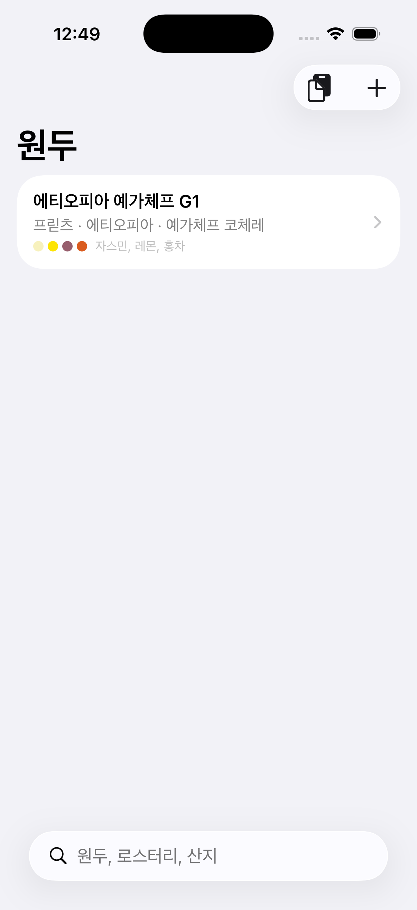
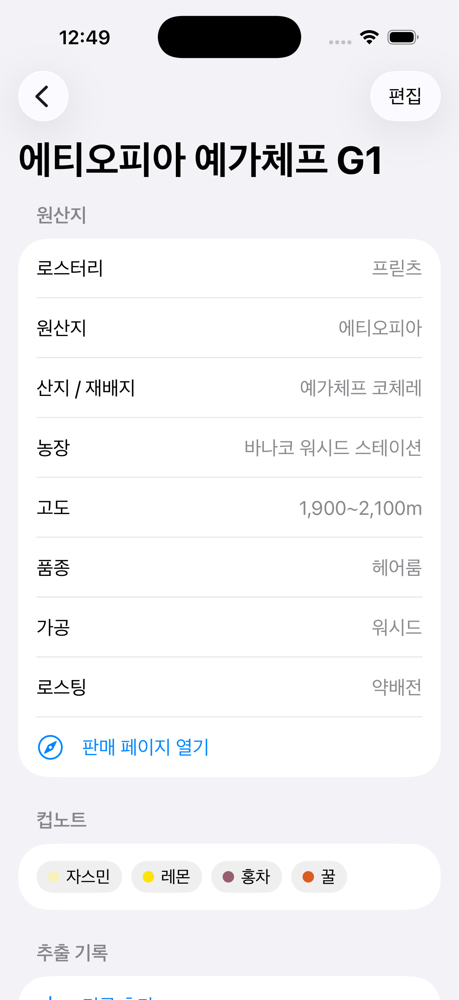
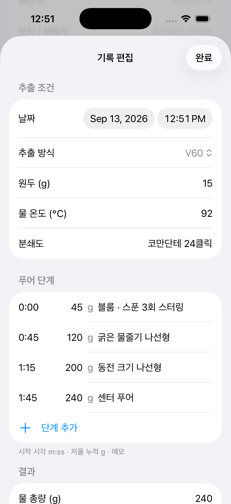
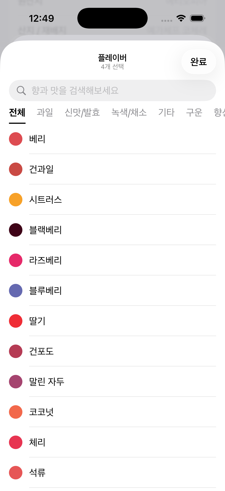
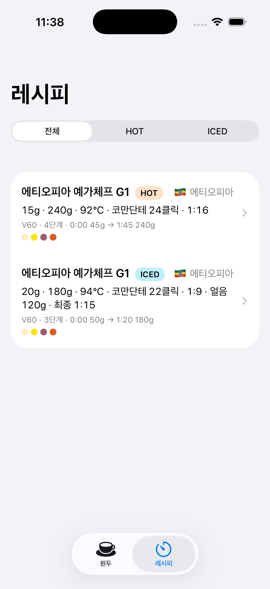
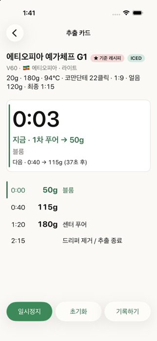
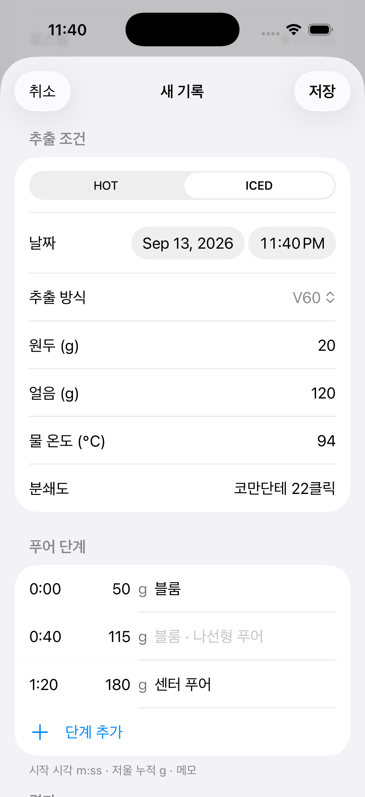
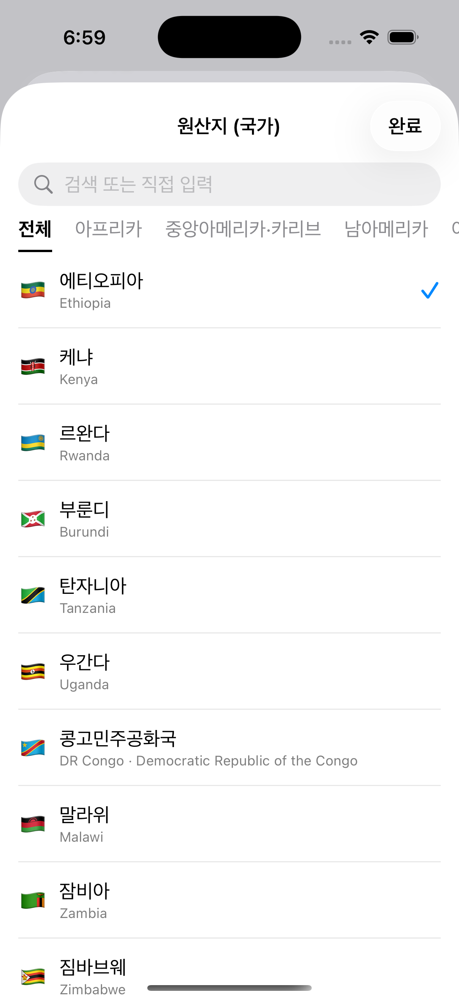
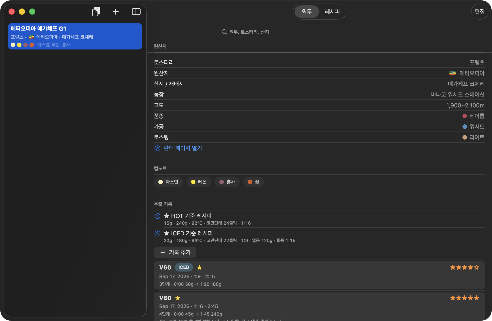
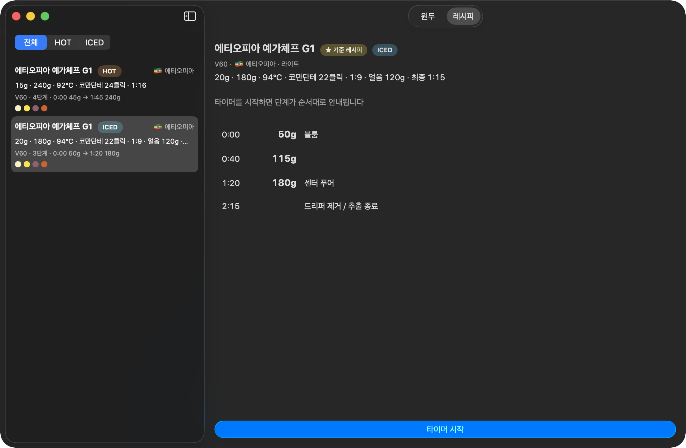

# BeanMuWiki

**내가 마신 원두를 문서처럼 쌓아 두는 개인용 커피 위키.** iPhone·iPad·Mac에서 같은 코드로 돌아갑니다. 이름은 Bean + 나무위키에서 왔습니다. 원두 한 봉지가 백과사전 항목 하나가 되고, 그 아래에 추출 기록이 편집 이력처럼 쌓입니다.

## 무엇을 하는 앱인가

홈카페에서 원두를 바꿀 때마다 같은 질문을 반복하게 됩니다. 이 원두는 어디 농장 것이었지, 지난번에 몇 도로 몇 그램 내렸더니 괜찮았지, 컵노트에 뭐라고 적혀 있었지. BeanMuWiki는 그 답을 원두별 문서 한 장에 모읍니다.

- **원두 문서** — 로스터리, 원산지, 산지/재배지, 농장, 고도, 품종, 가공 방식, 로스팅 포인트, 판매 페이지, 패키지 사진, 메모. 원산지(43개국, 국기), 품종(61종, 계통별), 가공 방식(37종), 로스팅 포인트(7단계, 원두색)는 카테고리 피커에서 고르고, 목록에 없으면 직접 입력해 추가합니다.
- **컵노트** — SCA 커피 플레이버 휠 97개에 한국 로스터리 통용 노트(유자, 청포도, 리치, 라벤더, 밀크초콜릿 …) 32개를 더한 129개 향미를 9개 카테고리(과일, 신맛/발효, 녹색/채소, 기타, 구운, 향신료, 견과/코코아, 단맛, 꽃)와 색으로 고릅니다. 목록에서는 색 점으로 보여 원두를 한눈에 구분할 수 있습니다.
- **추출 기록** — 추출 중 바뀌지 않는 조건(원두 g, 물 온도, 분쇄도)과 **푸어 단계 슬롯**(몇 초에 누적 몇 g을 어떤 방식으로)을 나눠 적습니다. 단계를 추가하면 물 총량과 비율이 따라 계산됩니다. 평점과 노트를 남기고, 잘 나온 기록을 ★ 기준 레시피로 두면 다음 기록이 그 값으로 미리 채워집니다.
- **HOT / ICED** — 기록마다 서빙을 고르고, ICED는 서버 얼음 g을 따로 적어 브루 비율과 최종 비율(물+얼음)이 함께 계산됩니다. ★ 기준 레시피는 서빙별로 하나씩(HOT 하나, ICED 하나) 둘 수 있습니다.
- **레시피 탭과 추출 카드** — 원두마다 서빙별 ★ 기준 레시피가 카드로 모이고 전체 / HOT / ICED로 걸러 볼 수 있습니다. 카드를 열면 조건 한 줄과 푸어 단계가 한 화면에 큰 글씨로 나오고, **타이머 시작**을 누르면 경과 시간에 맞춰 지금 부어야 할 누적 g과 기법, 다음 푸어까지 남은 초가 안내됩니다(단계 전환 햅틱, 추출 중 화면 켜짐 유지). **추출 끝**을 누르면 실제 시간이 들어간 새 기록이 만들어져 별점만 매기면 됩니다.
- **ChatGPT 연동 (앱 안에 AI 없음)** — 함께 들어 있는 프롬프트(`ChatGPT_Prompt.md`)에 원두를 알려주면 ChatGPT가 산지·품종·가공·컵노트를 조사하고 V60 레시피를 설계한 뒤 마지막에 JSON을 출력합니다. 그 JSON을 복사해 앱의 **가져오기** 버튼을 누르면 원두 문서와 기준 레시피가 한 번에 만들어집니다. 로스터리 표기(Heirloom, Washed, 플로럴, 레몬캔디 …)는 가져올 때 앱 목록의 표준 이름으로 자동 정규화됩니다. 맛 피드백을 주고 받은 보정 레시피도 같은 방법으로 붙여넣으면 기존 원두에 기록만 추가됩니다.

- **Mac 앱** — 같은 소스가 macOS 26에서 왼쪽 원두 목록 · 오른쪽 문서의 2열 창으로 열립니다. 레시피 탭도 카드 목록 · 추출 카드 2열. ⌘N 새 원두, ⇧⌘V 클립보드 가져오기, 우클릭 삭제.
- **JSON 백업** — 설정(톱니)에서 원두·기록 전체를 JSON 파일로 내보내고(AirDrop·공유 가능) 다시 가져옵니다. 가져오기는 항목별로 더 최근에 수정된 쪽을 남기고, 삭제도 기기 간에 전파됩니다(사진 제외).

데이터는 기기 안(SwiftData)에 저장됩니다. Google Drive 자동 동기화는 다음 버전에서 추가됩니다.

## 화면

| 원두 목록 | 원두 문서 | 추출 기록 (푸어 단계) | 플레이버 피커 |
|---|---|---|---|
|  |  |  |  |

| 레시피 탭 (HOT / ICED) | 추출 카드 (타이머 실행 중) | 기록 폼 (ICED) | 원산지 피커 (국기) |
|---|---|---|---|
|  |  |  |  |

| Mac — 원두 | Mac — 레시피 / 추출 카드 |
|---|---|
|  |  |

원두 편집 화면(배지 피커): `docs/screenshots/05-bean-form.png`

앱 아이콘 후보 비교: `docs/screenshots/icon-candidates.png`

## 요구 사항

Xcode 26.6 이상, iOS 26.0 / macOS 26.0 이상. 외부 의존성 없음 (SwiftUI + SwiftData). 한 타깃이 iPhone·iPad·Mac을 모두 빌드합니다.

## 실행

```
open BeanMuWiki.xcodeproj      # 실행 대상에서 iPhone 시뮬레이터·연결된 iPhone·My Mac 중 선택 후 ⌘R
```

- `-seed` 런치 인자: 샘플 원두 1개와 기록 2개(푸어 단계 포함)를 넣고 시작 (DEBUG 전용)
- `-inMemory` 런치 인자: 저장하지 않는 빈 상태로 시작 (UI 테스트가 사용)

실기기 설치는 타깃 → Signing & Capabilities에서 본인 Team을 고른 뒤 ⌘R. 무료 Apple ID는 7일마다 재설치가 필요합니다.

## 테스트

```
xcodebuild test -project BeanMuWiki.xcodeproj -scheme BeanMuWiki \
  -destination 'platform=iOS Simulator,name=iPhone 17 Pro'
```

- `BeanMuWikiTests/` — Swift Testing 단위 테스트 (비율·별점·기준 레시피·URL 보정·사진 축소·푸어 단계 파싱·JSON 가져오기·플레이버 휠·원산지/품종/가공/로스팅 데이터·스냅샷 병합/삭제 전파)
- `BeanMuWikiUITests/` — XCTest 유저 저니 (원두 추가 → 피커 선택 → 기록 추가 → 저장, 클립보드 JSON 가져오기, 레시피 탭 → 타이머 → 추출 끝 → 기록 저장)

## ChatGPT로 원두와 레시피 넣기

1. `ChatGPT_Prompt.md` 전체를 ChatGPT 대화의 첫 메시지(또는 프로젝트 지침)로 넣고 원두 이름·로스터리를 알려줍니다.
2. 답변 맨 끝의 ```json 코드블록을 복사합니다.
3. 앱 목록 화면 상단 **가져오기**(클립보드 아이콘)를 누릅니다. 처음 한 번 iOS가 붙여넣기 허용을 물어보면 허용합니다.

JSON의 `iced`/`iceGrams`로 HOT·ICED를 구분하고(옛 `"V60 ICED"` 표기도 인식), 한 원두에 두 레시피를 함께 넣으면 서빙별 기준 레시피가 각각 만들어집니다. JSON 스키마는 프롬프트의 📦 섹션이 기준이고, 파서는 `BeanMuWiki/Models.swift`의 `BeanImport`입니다. 실제 출력 예시는 `docs/import-example.json`에 있으며, 그대로 복사해 가져오기로 테스트할 수 있습니다. 프롬프트는 하리오 V60 + 홀츠클로츠 E80 그라인더 기준으로 쓰여 있으니 장비가 다르면 "고정 장비 세팅" 부분만 고쳐 쓰면 됩니다.

## 구조

```
BeanMuWiki/
  Models.swift          Bean, Brew, PourStep 모델과 BeanImport(JSON 파서)
  FlavorWheel.swift     플레이버 휠 데이터 (9카테고리 129향미, 별칭·표준 이름 매핑)
  BeanOptions.swift     원산지·품종·가공·로스팅 목록 (148개, 별칭·표준 이름 매핑)
  FlavorViews.swift     범용 카테고리 피커 시트, 폼 행, 배지, 플레이버 칩·색 점
  BeanListView.swift    원두 목록, 가져오기
  BeanDetailView.swift  원두 문서, 추출 기록 목록
  BeanFormView.swift    원두 생성/편집 (사진, URL, 플레이버)
  BrewFormView.swift    추출 기록 생성/편집 (조건 + 푸어 단계 + 평가)
  RecipesView.swift     레시피 탭 (원두별·서빙별 ★ 기준 레시피 카드)
  BrewCardView.swift    추출 카드 + 단계 안내 타이머
  Platform.swift        iOS/macOS 차이를 흡수하는 헬퍼 (클립보드, 이미지 디코딩, 키보드, 시트 크기)
  Sync/Snapshot.swift   전체 데이터 JSON 스냅샷·병합(LWW)·삭제 전파(Tombstone)
  Sync/SettingsView.swift  설정 시트 (JSON 백업)
BeanMuWikiTests/        단위 테스트
BeanMuWikiUITests/      UI 테스트
ChatGPT_Prompt.md       레시피 설계 프롬프트 + Import JSON 스키마
docs/                   로드맵(ROADMAP.md), 디자인 방향(DESIGN_DIRECTION.md), 스크린샷
```

## 로드맵

시장조사(`docs/ROADMAP.md`) 기준 다음 순서로 붙일 예정입니다: 로스팅 날짜와 신선도 배지 → 맛 5축 레이더 → 로스터리·산지별 색인 페이지 → 구매 정보 → 패키지 사진 텍스트 인식 → Google Drive 자동 동기화(iPhone↔Mac).

## 라이선스

MIT — `LICENSE` 참고.
